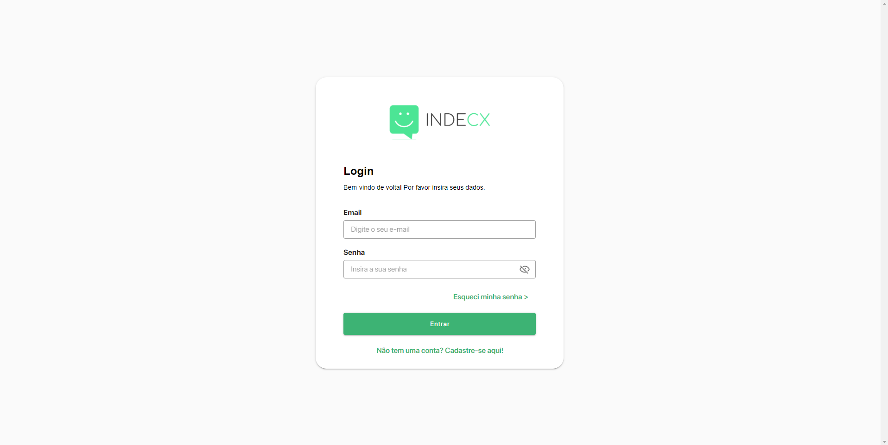

# [🚀 IndeCX - Front End Test](https://indecx-frontend-test.web.app/)


<h2 align="center">☕ Projeto Concluído</h2>



> https://indecx-frontend-test.web.app/ - Página Web Vue 3 Desenvolvida como Teste Front-End.

<br>

## 📝 Orientações

- Crie uma nova aplicação Vue.js que deve implementar o seguinte protótipo:

  - https://www.figma.com/file/yXwQAqJ53QfAwcMPb8xyxN/Teste-Front-End?node-id=0%3A1

- Adicione uma tela de login com validações, onde o usuário precisa inserir o e-mail e senha. Utilize o Vuelidate para fazer as validações dos campos de formulário.

- Integre a tela de login com uma rota API. Utilize o axios para fazer as requisições HTTP para a API.

- Após o login bem-sucedido, o usuário deve ser direcionado para uma tabela de produtos. Utilize o vuetify para criar a tabela.

- Adicione funcionalidades de CRUD (criar, ler, atualizar e deletar) na tabela de produtos. Utilize o axios para fazer requisições para API.

- Adicione a funcionalidade de logout e proteja as rotas de acesso somente para usuários autenticados.

- Crie uma nova branch no Github com o nome indecx_test para o seu exercício.

- Forneça o link do repositório e branch para o seu avaliador para que possa verificar o seu trabalho.

### Ajustes e melhorias

O projeto está em desenvolvimento, então as próximas atualizações serão voltadas nas seguintes tarefas:

- [x] Configurar Ambiente de Desenvolvimento.
- [x] Configurar Estrutura e Assets do Projeto.
- [x] Instalar Bibliotecas Iniciais [Vuelidate, Vuetify, ...].
- [x] Implementar Services da API.
- [x] Implementar Tela de Login.
- [x] Implementar Tela de Redefinir Senha.
- [x] Implementar Tela de Listagem de Produtos.
- [x] Implementar Modal de Excluir Produto.
- [x] Implementar Modal de Criar Produto.
- [x] Implementar Modal de Editar Produto.

## 💻 Pré-requisitos

Antes de começar, verifique se você atende às seguintes dependências:

- [`< Git >`](https://git-scm.com/)
- [`< NodeJS >`](https://nodejs.org/en/)

## ⚙️ Instalando o Projeto

Siga estas etapas:

```
git clone https://github.com/pumba-dev/indecx-frontend-test.git

cd indecx-frontend-test

npm install

npm run serve
```

## 💻 Feito Com:


## 🤝 Desenvolvido Por

<table>
  <tr>
    <td align="center">
      <a href="https://github.com/pumba-dev">
        <br>
        <sub>
          <b>Eu Mesmo</b>
        </sub>
      </a>
    </td>
  </tr>
</table>

[](https://www.linkedin.com/in/pumba-dev/)

## 😄 Seja um dos Contribuidores<br>

Entre em contato para se tornar um contribuidor.

## 💰 Donate

[](https://picpay.me/pumbadev)
[](https://nubank.com.br/pagar/1ou9f/ifu2K7YNO7)

## 📝 Licença

Copyright © 2023 Pumba Developer

[⬆ Voltar ao topo](#indecx-frontend-test)<br>
